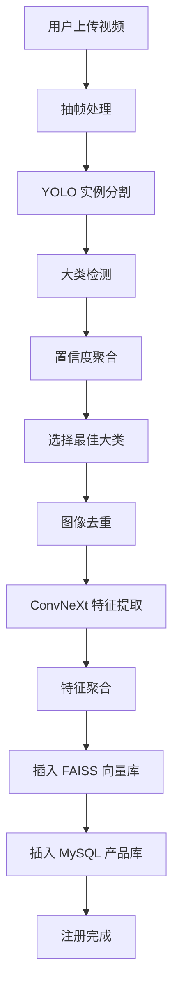
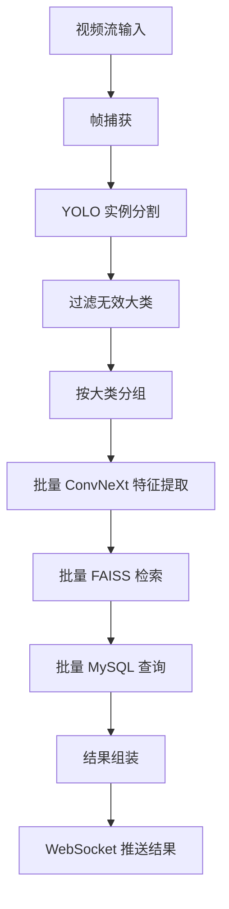
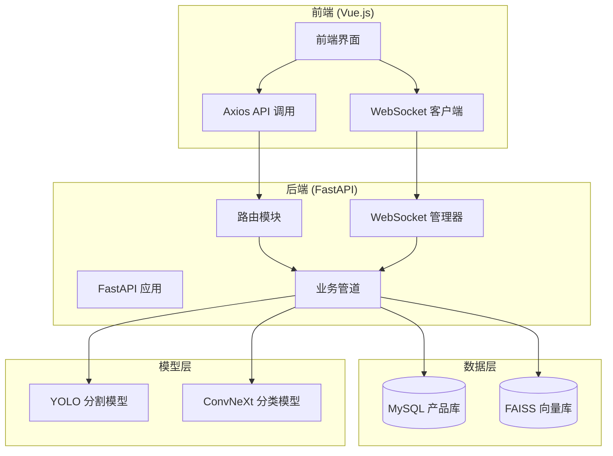

# 超市产品识别系统项目报告

## 项目概要

本项目是一个基于计算机视觉技术的智能超市产品识别与结算系统。通过深度学习模型实现对超市商品的实时自动识别，支持商品注册、实时监控和结算功能。系统采用前后端分离架构，后端基于 Python FastAPI 提供 RESTful API 和 WebSocket 服务，前端使用 Vue.js 构建现代化用户界面。

系统核心功能包括：
- **商品注册**：上传商品视频，通过 AI 模型自动提取特征并注册到数据库
- **实时识别**：支持摄像头、视频文件和 IP 摄像头输入，实现毫秒级商品识别
- **监控界面**：实时显示识别结果，支持暂停/恢复操作
- **WebSocket 通信**：实时推送识别结果到前端界面

## 项目使用到的技术栈

### 后端技术栈
- **Python 3.8+**：主要编程语言
- **FastAPI**：高性能异步 Web 框架，提供自动 API 文档生成
- **Uvicorn**：ASGI 服务器，用于部署 FastAPI 应用
- **OpenCV**：计算机视觉库，用于视频处理和图像操作
- **PyTorch**：深度学习框架，用于模型推理
- **FAISS**：Facebook AI 开发的向量搜索引擎，用于高效相似度检索
- **PyMySQL**：MySQL 数据库连接库
- **NumPy**：数值计算库，用于数组操作

### 前端技术栈
- **Vue 3**：渐进式 JavaScript 框架，使用 Composition API
- **Vite**：下一代前端构建工具，提供快速的开发体验
- **Tailwind CSS**：实用优先的 CSS 框架，用于快速构建美观界面
- **Axios**：基于 Promise 的 HTTP 库，用于 API 请求
- **Pinia**：Vue 3 官方状态管理库
- **Vue Router**：官方路由管理器

### AI 模型技术栈
- **YOLOv11**：用于实例分割，检测商品位置并提取局部图像
- **ConvNeXt Tiny**：轻量级卷积神经网络，用于商品特征提取
- **FAISS**：向量数据库，用于商品特征的相似度检索

### 数据库技术栈
- **MySQL**：关系型数据库，存储商品详细信息
- **FAISS**：向量数据库，存储商品特征向量

## 业务流程图

### 产品注册业务流程图


注册流程从用户上传商品全角度视频开始，通过抽帧、AI 检测、特征提取等步骤，最终将商品信息存储到数据库中。

## 数据流程图

### 实时识别数据流程图


实时识别流程对视频流进行连续处理，从帧捕获到最终结果推送，实现低延迟的商品识别。

## 整体框架结构



系统采用分层架构设计：
- **前端层**：负责用户交互和数据展示
- **后端层**：处理业务逻辑和 API 请求
- **数据层**：存储结构化数据和向量数据
- **模型层**：提供 AI 推理能力

## 介绍核心业务和代码实现

### 核心业务模块

#### 1. 商品注册业务
**业务描述**：允许用户上传商品的旋转视频，通过 AI 自动分析并注册商品信息到系统。

**代码实现**：
- **入口**：`src/api/routers/registration.py` - 提供文件上传 API
- **管道**：`src/pipelines/registration.py` - 实现完整的注册流程
- **关键步骤**：
  - 视频抽帧：每隔 2 帧采样，避免数据冗余
  - 图像去重：基于哈希算法过滤相似帧
  - 大类检测：使用 YOLO 模型识别商品大类（袋装、瓶装、盒装、罐装）
  - 置信度聚合：统计各大类的检测置信度，选择最优大类
  - 特征提取：使用对应大类的 ConvNeXt 模型提取特征向量
  - 数据存储：同时写入 MySQL（商品信息）和 FAISS（特征向量）

#### 2. 实时识别业务
**业务描述**：对视频流进行实时分析，识别其中的商品并返回详细信息。

**代码实现**：
- **入口**：`src/api/routers/recognition.py` - 提供 MJPEG 流和 WebSocket API
- **管道**：`src/pipelines/recognition.py` - 实现实时识别逻辑
- **关键步骤**：
  - 帧处理：连续捕获视频帧
  - 批量推理：按大类分组进行批量特征提取，提高效率
  - 向量检索：使用 FAISS 进行相似度搜索
  - 结果组装：结合数据库查询结果，生成完整的识别信息
  - 实时推送：通过 WebSocket 将结果推送到前端

### 核心代码组件

#### 模型管理器 (`src/models/manager.py`)
统一管理所有 AI 模型的加载和推理：
- `YoloSegmentationModel`：负责实例分割和大类检测
- `ConvNeXtFeatureModel`：负责细粒度特征提取
- 支持批量推理，优化性能

#### 数据库管理器
- **产品数据库** (`src/db/product_db.py`)：基于 MySQL，存储商品元数据
- **向量数据库** (`src/db/vector_db.py`)：基于 FAISS，实现高效向量检索

#### 工具模块
- **配置管理** (`src/utils/config_utils.py`)：集中管理系统配置
- **图像处理** (`src/utils/image_utils.py`)：提供图像去重、预处理等功能
- **特征处理** (`src/utils/feature_utils.py`)：特征向量聚合和处理

## 性能优化点

### 1. 批量推理优化
- **问题**：单张图片推理效率低，GPU 利用率不足
- **解决方案**：按大类分组进行批量特征提取，显著提升吞吐量
- **效果**：在多商品场景下，推理速度提升 3-5 倍

### 2. 向量检索优化
- **索引选择**：使用 FAISS IndexFlatIP（内积索引）结合向量归一化，实现余弦相似度检索
- **批量查询**：支持一次查询多个向量，减少索引访问开销
- **内存管理**：索引文件持久化到磁盘，避免重复加载

### 3. 数据库查询优化
- **连接池**：使用 PyMySQL 连接池复用数据库连接
- **批量查询**：一次查询多个商品 ID，减少数据库往返
- **缓存机制**：LRU 缓存常用商品信息，减少数据库压力

### 4. 异步处理优化
- **后台任务**：商品注册使用 FastAPI BackgroundTasks 异步处理
- **WebSocket 通信**：实时推送识别结果，避免轮询
- **生命周期管理**：FastAPI lifespan 确保资源正确初始化和释放

### 5. 前端性能优化
- **状态管理**：使用 Pinia 进行集中状态管理
- **组件懒加载**：按路由分割代码，减少初始包体积
- **响应式设计**：Tailwind CSS 提供一致的 UI 体验

### 6. 系统架构优化
- **前后端分离**：解耦开发和部署，提高可维护性
- **模块化设计**：清晰的分层架构，便于扩展和测试
- **配置外部化**：YAML 配置文件支持不同环境部署

## 部署和运行

### 环境要求
- Python 3.8+
- Node.js 16+
- MySQL 8.0+
- CUDA 11.0+ (可选，用于 GPU 加速)

### 快速启动
```bash
# 后端启动
cd /path/to/project
pip install -r requirements.txt
python app.py

# 前端启动
cd frontend
npm install
npm run dev
```

### 生产部署
- 使用 Uvicorn workers 提高并发处理能力
- 配置 Nginx 反向代理和静态文件服务
- 设置 MySQL 连接池和索引优化
- 考虑使用 Docker 容器化部署

## 总结

本项目展示了现代 AI 技术在零售业的应用，通过计算机视觉和深度学习实现了高效的商品识别系统。系统具有良好的可扩展性和性能表现，为超市数字化转型提供了技术参考。

关键创新点包括：
- 多模型协同工作（分割 + 分类）
- 实时流处理架构
- 向量检索技术应用
- 前后端实时通信

未来可以扩展的方向包括多摄像头协同、商品推荐算法、库存管理集成等。